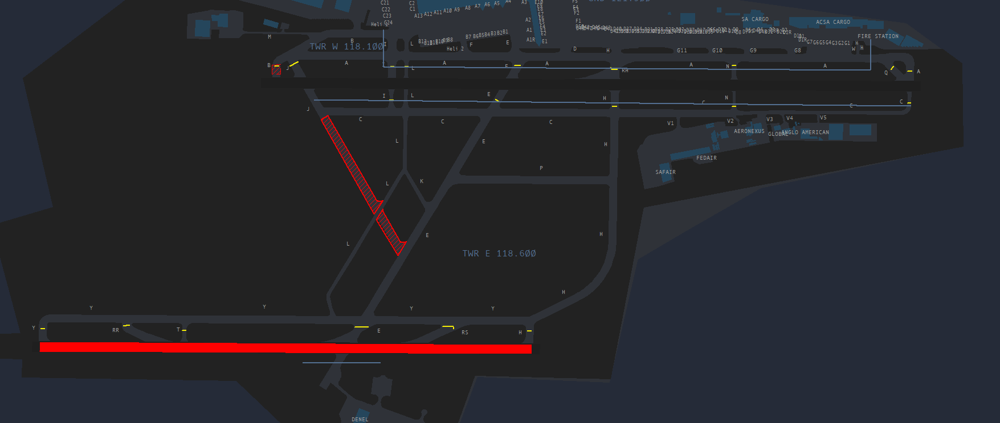

# Tower
The responsibility of Tower at O.R. Tambo is split between two dedicated ATS Units, both with the callsign "O.R. Tambo Tower", on 118.100 MHz (West) and 118.600 (East).

The Tower West controller is responsible for the operations of Runway 03L/21R, and also assumes responsibility for Tower East whenever the ATS position is offline.
The Tower East controller is responsible for the operations of Runway 03R/21L, including taxi from the runway to hold short of Runway 03L.

!!! note
    As the frequency for departure is already handed in the IFR clearance, handoffs to the next ATS unit (Johannesburg Radar) is not required with departing aircraft.

## Visual Flight Rules (VFR) Aircraft

  * There are no published VFR departure or arrival routings in and out of the Johannesburg CTR. Traffic should instead be asked to report either leaving or entering the CTR, or via of the VRPs.
  * Circuit altitude is 6500ft, with circuits conducted away from the runways, Runway 03L (left), Runway 03R (right), Runway 21R (right), Runway 21L (left).
  * Controllers should avoid extending downwinds signicifantly to avoid conflicts with traffic at Johannesburg-Rand or Waterkloof.

!!! info "Circuit Clearance"
    ZSABC, hold position, after departure Runway 03L, left hand circuits, not above 6500ft, report left downwind Runway 03L.

!!! info "Exit Clearance"
    ZSABC, hold position, after departure Runway 06, cleared to leave the control zone to the west, not above 6500ft report overhead the Sandton City Tower."

// insert VRP map whenever the hell I make one

## Wake Seperation

### Arrivals (nm)
| Lead  | J | H | M | L |
| :---------: | :---------: | :---------: | :---------: | :---------: | 
| J     | ||||
| H     | 6 | 4 | ||
| M     | 7 | 5 | 5 | |
| L     | 8 | 6 | 5 | 5 |

### Departures (mins)

| Lead  | J | H | M | L |
| :---------: | :---------: | :---------: | :---------: | :---------: | 
| J     | ||||
| H     | 2 | |||
| M     | 3 | 2 | ||
| L     | 3 | 2 | 2 | |

!!! note   
    Aircraft which are not affected by wake turbulence, and are operating on a different SID to the leading aircraft infront may be released as soon as the first aircraft is airborne.

## HIRO
If deemed neccesary, HIRO will be in effect for landings into Runway 03R/21L. The aim is to expedite the flow of traffic to maximise efficiency and ensure the best arrival flow possible.

An aircraft may be cleared to land provided that:

* The Tower Controller is satisfied that the aircraft is turning and planning to vacate at a high speed exit provided.
* The aircraft is expected to keep moving past the stopbar and not come to a full stop.

!!! info "Landing /w Traffic Vacating"
    SAA294, traffic vacating ahead via E, Runway 03L, cleared to land.

## Missed Approach
All aircraft are to comply with the standard missed approaches to avoid conflict, the controllers are not to issue Runway Track until advised.

!!! info "Missed Approach"
    SAA294, comply standard missed approach.

Only once the pilot has been observed to be following the missed approach, should you then handoff to Johannesburg Radar for further.